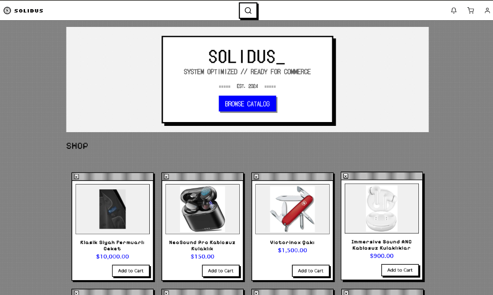
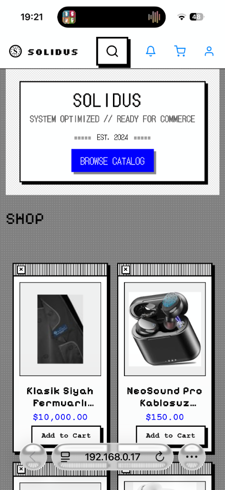
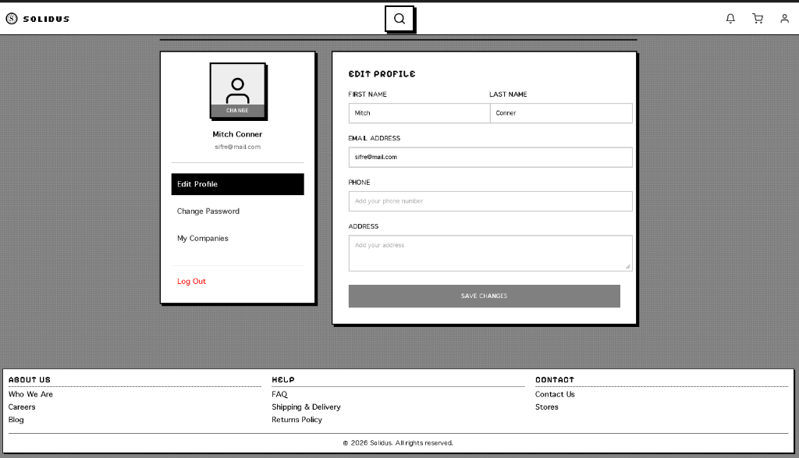
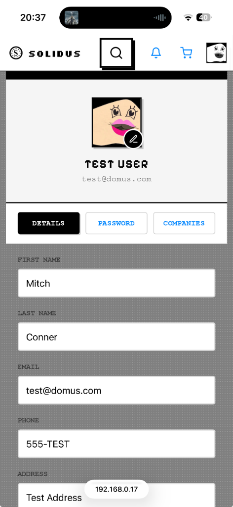
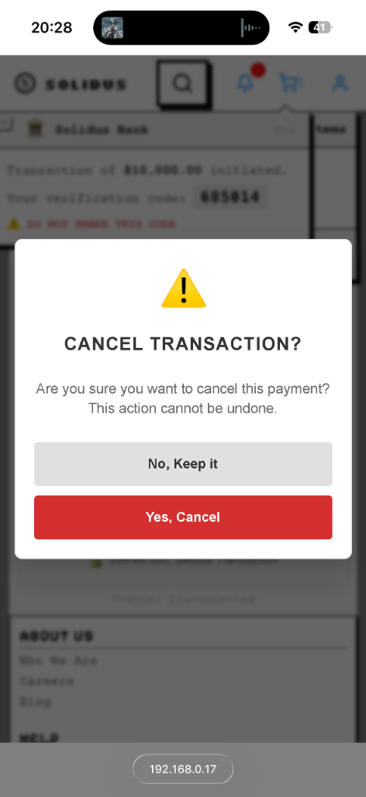
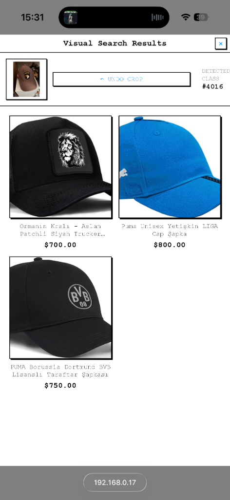

# Solidus (DomusMercatoris Client)

Modern, performance-oriented Angular e-commerce frontend application with a brutalist design.


<div align="center">
  
  
</div>

## 🚀 About The Project

Solidus is the Angular-based client application for the **DomusMercatoris** project. It delivers a unique user experience by adopting "Brutalist" design principles (thick borders, monospace fonts, sharp corners). It is developed using Angular's latest features (Standalone Components, Signals, Control Flow Syntax).

## ✨ Key Features

### 🎨 Brutalist UI Design
- **Bold and Clear:** Thick black borders, high contrast, and monospaced typography.
- **Minimalist Animations:** Functional transitions stripped of unnecessary decorations.

### � Responsive Mobile Profile
The profile page features a dedicated mobile view optimized for smaller screens with large touch targets and simplified navigation:

<div align="center">
  
  <br><br>
  
  
</div>

### �🔍 Advanced Visual Search (ResNet Integration)
This project uses a "Golden Ratio" image processing pipeline for high-accuracy product search:

<div align="center">
  
</div>

1.  **Image Upload & Cropping:**
    -   Integrated **`ngx-image-cropper`**.
    -   When a user selects an image, a modal appears allowing them to **crop** the specific area of interest.
    -   This prevents sending irrelevant background noise (like keyboards, tables) to the AI.
2.  **High-Quality Transfer:**
    -   The cropped image is sent to the backend in its original resolution (PNG/JPEG) without client-side downscaling, ensuring the best input for the background removal service (`rembg`).
3.  **HEIC Support:**
    -   Automatic conversion of Apple HEIC format images via `heic2any`.

### ⚡ Performance and UX
- **Infinite Scroll:** Natural flow product listing developed using the `IntersectionObserver` API.
- **Responsive Structure:** Mobile-first design approach.

### 🛠 Technical Infrastructure
- **Angular 17+ (Standalone Components):** Module-free, modern architecture.
- **Signals:** Angular Signals for reactive state management.
- **Proxy Configuration:** Seamless development environment with Backend API.

## 📦 Installation and Running

Follow these steps to run the project locally:

### Prerequisites
- Node.js (LTS version recommended)
- npm

### Steps

1. **Clone the repository:**
   ```bash
   git clone <repo-url>
   cd DomusMercatorisAngular
   ```

2. **Install dependencies:**
   ```bash
   npm install
   ```
   *Note: This includes `ngx-image-cropper`.*

3. **Start the development server:**
   ```bash
   npm start
   ```
   This command starts the application. Check the terminal output for the correct local URL (usually `http://localhost:4200`). API forwarding is handled via `proxy.conf.json`.

   > **Note:** You may see a warning: *"This is a simple server for use in testing or debugging... Binding this server to an open connection can result in compromising your application"*.
   >
   > This is **normal and expected**. We use `--host 0.0.0.0` to allow you to test the application on other devices (like your phone) connected to the same network. It is safe for development.

## 🧪 Tests

The application uses the **Vitest** test runner.

- **To Run Unit Tests:**
  ```bash
  npm test
  ```

## 📂 Project Structure

```
src/app/
├── components/       # Reusable UI components (ProductList, ImageCropper Modal, etc.)
├── guards/           # Route guards
├── interceptors/     # HTTP interceptors
├── models/           # TypeScript interfaces
├── pages/            # Page components
│   └── search/       # Search logic including Cropper implementation
├── services/         # Business logic (SearchService handles API calls)
└── app.routes.ts     # Routing configuration
```

---
© 2026 Solidus. All rights reserved.
