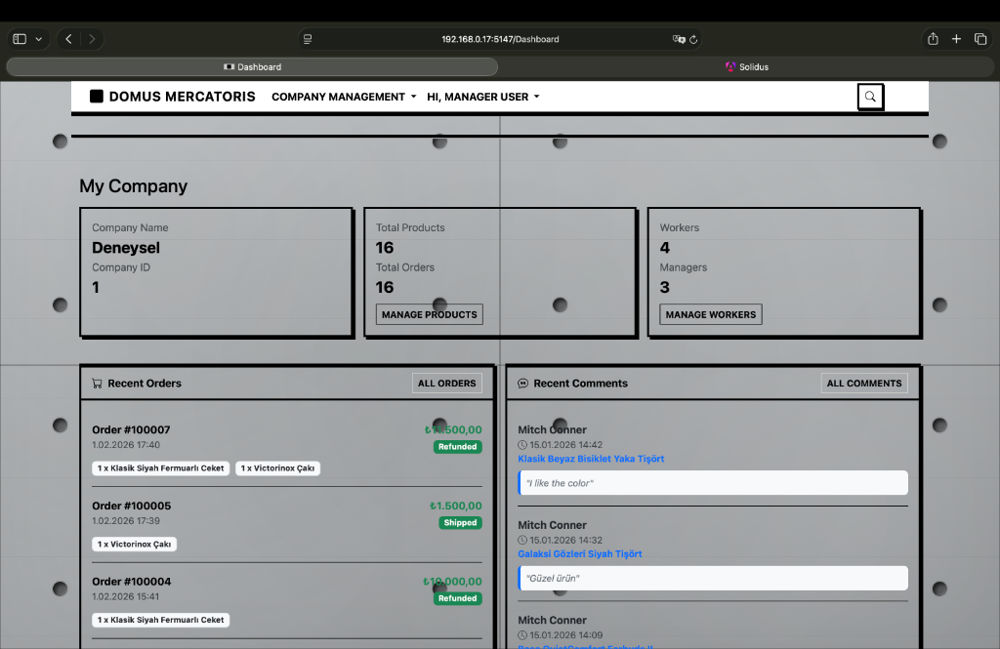
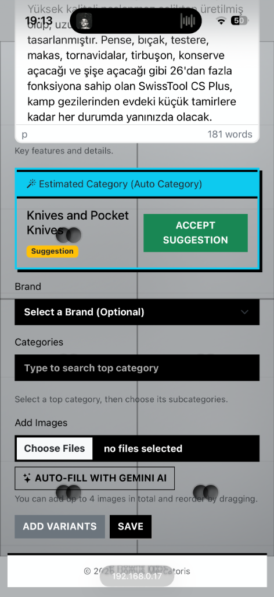
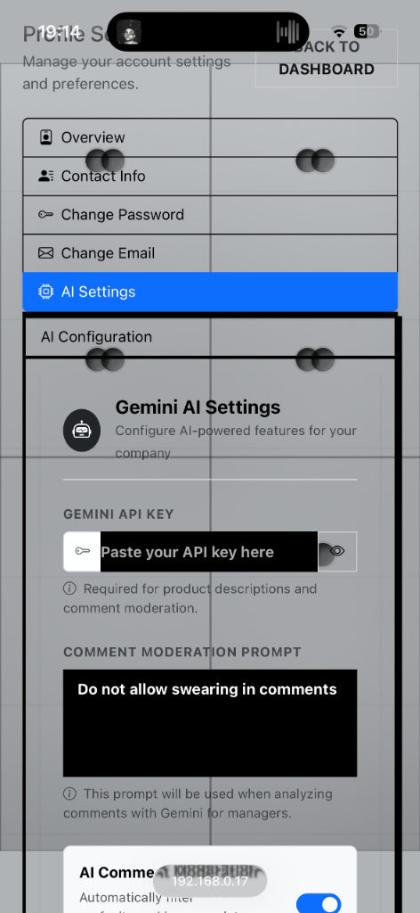
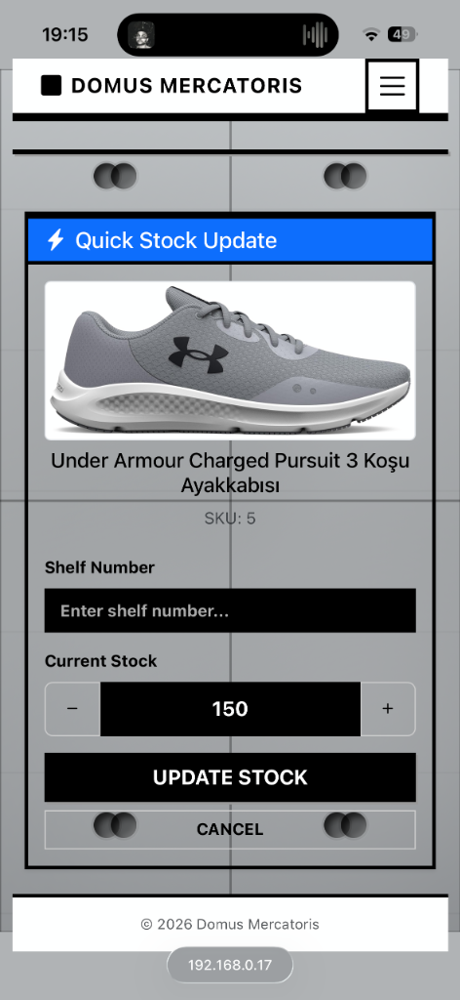
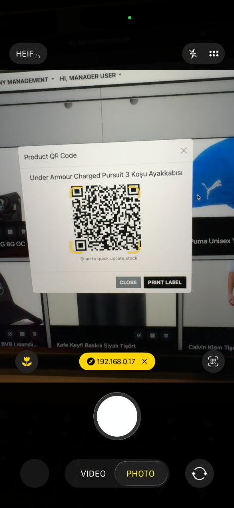

# Domus Mercatoris - Admin & Moderator Panel (MVC)

This is the server-side rendered **ASP.NET Core MVC** application that serves as the **Admin and Moderator Panel** for the Domus Mercatoris platform. It allows authorized personnel to manage the e-commerce system.

## 🛠 Technology Stack

*   **Framework:** ASP.NET Core MVC 9
*   **Rendering:** Razor Pages / Razor Views
*   **Styling:** Bootstrap / Custom CSS
*   **Database:** Entity Framework Core (Shared with REST API)
*   **Authentication:** Cookie-based Authentication (Integrated with Identity)

## ✨ Key Features

### 🛡 Moderator Tools
*   **User Management:** Ban/Unban users, view user details.
*   **Product Management:** Add, edit, remove products and variants.
*   **Category Management:** Organize product categories and auto-categories.
*   **Banner Management:** Configure homepage banners.

### 🤖 AI Integration Panel
*   **Clustering Management:** View and manage product clusters generated by the AI service.
*   **Gemini Integration:** Uses `GeminiService` for advanced text processing or descriptions.
*   **Python Runner:** This application is responsible for **automatically starting the Python AI Service** (`AI/api.py`) via `PythonRunnerService`.

### 📊 Dashboard
*   View sales statistics, active users, and system health.
*   Manage cargo and delivery statuses.

## 🚀 Getting Started

### Prerequisites

*   .NET 9 SDK
*   SQL Server (or configured database)
*   Python 3.11 (for the AI service to be launched)
*   **Default Credentials:**

    | Role | Email | Password |
    | :--- | :--- | :--- |
    | **Rex** | `rex@domus.com` | `RexPassword1!` |
    | **Moderator** | `moderator@domus.com` | `ModeratorPassword1!` |
    | **Manager** | `manager@domus.com` | `ManagerPassword1!` |
    | **User** | `test@domus.com` | `TestUserPassword1!` |

### Running the Application

1.  Navigate to the MVC project directory:
    ```bash
    cd MVC/MVC
    ```
2.  Restore dependencies:
    ```bash
    dotnet restore
    ```
3.  Run the application:
    ```bash
    dotnet run
    ```
    The application usually listens on `http://localhost:5000` or `https://localhost:5001`.

## 📂 Project Structure

*   `Pages/`: Razor Pages for the UI (Account, Moderator, Shared, etc.).
*   `Services/`: Application logic (GeminiService, ClusteringService, etc.).
*   `Middleware/`: Custom middleware (BanEnforcement, ExceptionLogging).
*   `wwwroot/`: Static assets (CSS, JS, Images).

## 📷 Application Gallery

The Admin Panel provides a comprehensive interface for managing the Domus Mercatoris ecosystem.

### 📊 Dashboard & Overview
<div align="center">
  
  <br>
  <em>Real-time overview of sales, active users, and system health status.</em>
</div>
<br>

### 🛡 User & Role Management
<div align="center">
  
  <br>
  <em>Advanced user filtering, role assignment, and ban management interface.</em>
</div>
<br>

### 📦 Product Catalog
<div align="center">
  
  <br>
  <em>Detailed product listing with stock tracking and variant management.</em>
</div>
<br>

### 🤖 AI & Clustering Analysis
<div align="center">
  
  <br>
  <em>Visual representation of product clusters generated by the AI service.</em>
</div>
<br>

### 🎨 Content & Banner Control
<div align="center">
  
  <br>
  <em>Homepage banner configuration and visual content management.</em>
</div>
<br>


---
© 2026 Solidus. All rights reserved.
