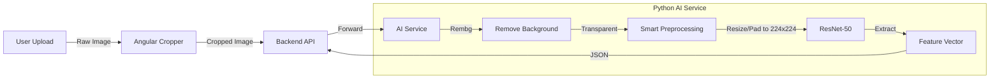

# Domus Mercatoris

Domus Mercatoris is a modern, microservices-based e-commerce platform built with a "Brutalist" design philosophy. It integrates advanced AI capabilities for visual product search and features a robust, scalable architecture.

## 🏗 System Architecture

The project consists of three main components:

1.  **Frontend (Angular):**
    *   **Project:** `DomusMercatorisAngular`
    *   **Tech Stack:** Angular 17+ (Standalone Components, Signals), TypeScript.
    *   **Features:** Brutalist UI, Infinite Scroll, **Visual Search with Image Cropping**.
    *   **Responsibility:** User interface, handling user input, cropping images for AI processing.

2.  **Backend API (ASP.NET Core):**
    *   **Project:** `DomusMercatorisDotnetRest`
    *   **Tech Stack:** .NET 8, C#, Entity Framework Core.
    *   **Features:** REST API, JWT Authentication, Product Management, **AI Proxy/Gateway**.
    *   **Responsibility:** Business logic, database operations, orchestrating requests between Frontend and AI Service.

3.  **AI Service (Python):**
    *   **Project:** `AI`
    *   **Tech Stack:** Python 3.11, FastAPI, PyTorch (ResNet-50), **Rembg**, **Pillow-Heif**.
    *   **Features:** Image Feature Extraction, Background Removal, Clustering, **HEIC Support**.
    *   **Responsibility:** Processing images to generate feature vectors for visual search.

## 🖼 The "Golden Ratio" Image Processing Pipeline

To ensure the highest accuracy for visual search (ResNet-50), we implement a specific processing pipeline:

1.  **User Selection (Angular):** The user uploads an image and **crops** the relevant area using the client-side cropper (`ngx-image-cropper`). This ensures only the object of interest is sent.
2.  **Background Removal (Python):** The cropped image is sent to the AI service, where **`rembg`** removes the background, isolating the product.
3.  **Smart Preprocessing (Python):** The transparent image is composited over a **white background** and resized to **224x224** while preserving the aspect ratio (padding with white).
4.  **Feature Extraction (Python):** The processed image is fed into ResNet-50 to generate a feature vector.

## 🚀 Getting Started

### Prerequisites

*   **Node.js** (LTS) & **npm**
*   **.NET 8 SDK**
*   **Python 3.11** (Required for `rembg` compatibility)
*   **Docker** (Optional, for containerized deployment)

### Running the Project

1.  **AI Service:**
    *   Navigate to the root directory.
    *   Set up the virtual environment: `python3.11 -m venv venv`
    *   Activate and install requirements: `source venv/bin/activate && pip install -r AI/requirements.txt`
    *   The .NET application will attempt to start this service automatically, or you can run it manually.

2.  **Backend API:**
    *   Navigate to `DomusMercatorisDotnetRest`.
    *   Run `dotnet run`.
    *   The API usually listens on `http://localhost:5200`.

3.  **Frontend:**
    *   Navigate to `DomusMercatorisAngular`.
    *   Run `npm install` (first time).
    *   Run `npm start`.
    *   Access the app at `http://localhost:4200`.

## 📂 Repository Structure

*   `AI/` - Python FastAPI service for AI operations.
*   `DomusMercatorisAngular/` - Angular Frontend application.
*   `DomusMercatorisDotnetRest/` - Main ASP.NET Core REST API.
*   `DomusMercatoris.Core/` - Shared Domain Entities and Interfaces.
*   `DomusMercatoris.Data/` - Database Context and Infrastructure.
*   `DomusMercatoris.Service/` - Business Logic Services.

---
© 2026 Solidus. All rights reserved.
